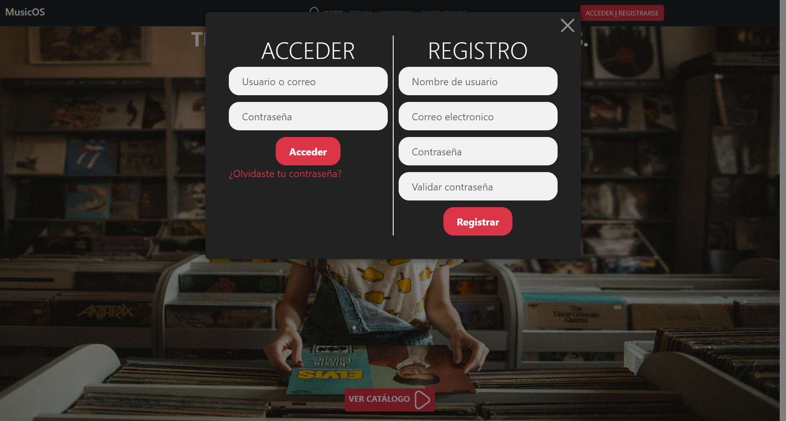
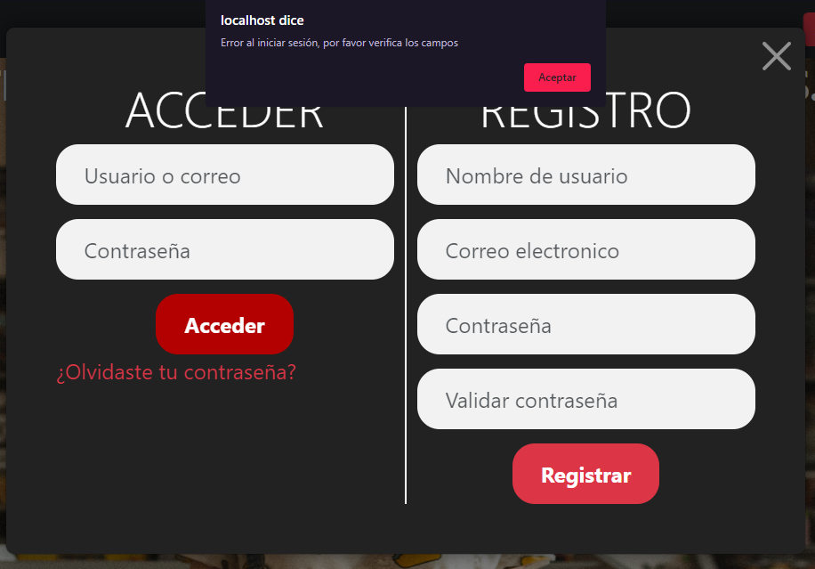

# Database

The database was built using the MySQL engine, which was encapsulated within a Docker application. It comprises four tables: Users, Orders, Albums, and Sales.

These tables are interconnected through a linear relationship, forming a chain of associations. Sales are connected to Albums, Albums are linked to Orders, and finally, Users are connected to Orders. This sequential linkage allows for the retrieval and organization of data across multiple tables, facilitating efficient data management and analysis.

</img>

<a href="/sql/">Learn more about the script of the SQL file, the construction of the Docker application, and the REST API.</a>

# Login

To log in, simply click on the red button located at the top right corner. This action will open a PopUp with two options: "Log in" or "Register as a user of the application". Once you have successfully logged in, a section will appear displaying the labels "Account" and "Options". These buttons provide users with the ability to interact with their account and customize settings.

</img>

</img>

# CRUD

In order to initiate the registration process and enable users to create an account, it is essential that certain fields are filled out. These fields are marked as mandatory, meaning they must be completed in order to proceed. They serve as crucial information required to establish a user profile.

Once the initial registration is completed, the user will be prompted to enter additional data, commonly referred to as final data, to complete the account setup. These details may include personal information, contact information, or any other relevant information that is necessary to tailor the user's account experience.

Similarly, when it comes to granting access to a user, specific fields must be provided. These fields, like the ones during registration, are compulsory and cannot be skipped. They play a critical role in ensuring the user's identity and authorization, allowing them to access specific features, areas, or privileges within the system or platform.

Overall, the mandatory fields during user creation and access provisioning are vital requirements to facilitate a smooth registration process and establish the necessary information and credentials for a user's account.

</img>

The majority of the content displayed on the page is sourced from a database, which serves as a central repository of information. This database contains various data related to the subject matter of the page. The content is then extracted from this database and presented on the page in several different aspects or sections.

One of these aspects is the catalog, where users can view a collection of items or products. This catalog showcases a wide range of offerings, such as products, services, or any other type of content relevant to the page's purpose. Users can browse through the catalog, gaining access to detailed information about each item.

Additionally, the page provides a section dedicated to displaying the best-selling albums. This section highlights the albums that have experienced the highest sales or popularity within a given timeframe. Users can explore and discover the most popular music albums based on sales or other relevant metrics.

Furthermore, there is a feature that allows users to visualize the top-selling genres. This section presents an overview of the genres or categories of content that have been most sought after or consumed by users. It provides insights into the trends and preferences of the audience, allowing users to explore and delve into the most popular genres.

Lastly, the page includes a breakdown of the team members. This section provides information about the individuals who contribute to the development, maintenance, and operation of the page or the associated project. It may include details such as names, roles, responsibilities, and possibly even brief biographies or profiles.

Overall, the page leverages a database to extract and present content in multiple dimensions, enabling users to access a catalog, discover best-selling albums, explore popular genres, and learn about the team behind the project. This approach enhances the user experience by providing comprehensive and dynamic information relevant to the page's subject matter.

# API REST
Despite the fact that the database uses MySQL as its engine, it is queried by the MariaDB engine. There is no problem at all since both engines are SQL-based.
The API is distributed into different parts to consume the database:
* "GET" methods
* "SET" methods

The goal is to have separate methods for each operation to be performed independently.

<a>API REST</a>

# Technologies

* Python
* Flask
* Bootstrap
* Jinja2
* MySQL
* MariaDB
* Docker
* JSON
* JavaScript

# Operation

1. Install the dependencies for Python: `pip install flask requests mariadb`.
2. (Optional) Build and deploy the database using docker: `cd sql/docker; docker-compose up -d`.
3. Run API: `cd sql; py api_rest.py`.
4. Run Web: `py server.py`.

## Note:
If you are using any Linux distribution, you can run the file start.sh